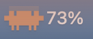
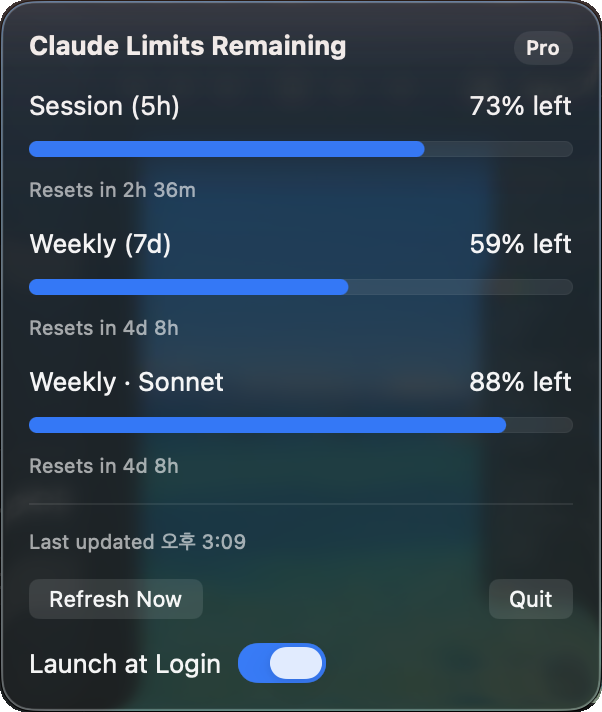
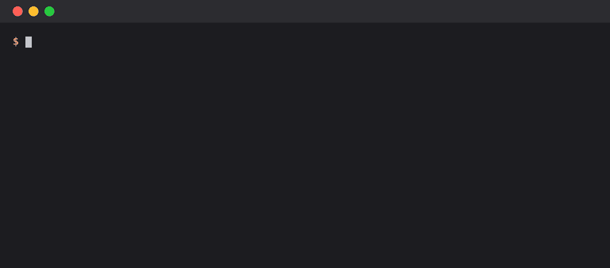

# Claude Usage Bar

[English](README.md) | **한국어**

[](https://github.com/hamin-apple/claude-usage-bar/actions/workflows/ci.yml)
[](https://github.com/hamin-apple/claude-usage-bar/releases/latest)
[](LICENSE)


[](#npx로-설치)
[](#중요-안내)

claude.ai 구독 한도 중 **남은** 양(5시간 세션, 7일 주간)을 보여주는 작은 macOS 메뉴 막대 앱입니다.

- **메뉴 막대:** 남은 양에 맞는 Clawd 게이지 아이콘과 남은 세션 비율(예: `73%`)
- **클릭:** 세션, 주간, 모델별 주간 한도의 남은 양 막대, 각 한도가 초기화되기까지 남은 시간, 요금제 배지(예: `Pro`), Refresh Now, Launch at Login, Quit

<p>
  
  <br>
  
</p>

<sub>mock 모드(`--mock 27`)에서 찍은 화면이며 실제 계정 데이터가 아닙니다.</sub>

앱에 나오는 비율은 모두 사용한 양이 아니라 **남은** 양입니다. claude.ai의 사용량 페이지는 사용한 쪽을 보여주므로, 거기서 `31% used`는 여기서 `69%`로 나옵니다.

## 중요 안내

앱을 쓰기 전에 읽어 주세요.

- **개인 프로젝트입니다.** Anthropic이 만들거나 보증하거나 지원하는 앱이 아닙니다. "Claude"는 Anthropic, PBC의 상표입니다.
- **비공식 API를 씁니다.** 앱은 Anthropic 공개 문서에 없는 `https://api.anthropic.com/api/oauth/usage`를 호출합니다. 언제든 바뀌거나 동작하지 않을 수 있습니다.
  필요한 값만 읽고 모르는 필드는 무시하지만, 형식이 크게 바뀌면 값이 표시되지 않을 수 있습니다.
- **이용약관 허용 여부를 확인하지 않았습니다.** 앱은 Claude Code가 키체인에 저장한 OAuth 토큰을 빌려 Claude Code 밖에서 사용합니다.
  Anthropic 약관이 이를 허용하는지 확인하지 않았고, 허용하지 않을 수도 있습니다. 최신 약관을 직접 읽어 보세요. Claude 계정에 생길 수 있는 결과를 포함해 **사용에 따른 책임은 본인에게 있습니다.**
- **요청 식별자.** 엔드포인트가 요청을 받아들이도록 앱은 Claude Code CLI와 같은 `User-Agent: claude-code/<version>`을 보냅니다. 그래서 요청이 Claude Code의 요청처럼 보입니다.
  이것이 불편하다면 앱을 쓰지 마세요.
- **토큰 처리.** 토큰은 요청 직전에 읽어 메모리에만 두고, 로그나 파일에 쓰지 않으며, 앱이 갱신하지도 않습니다. 관련 코드는 짧습니다: `Credentials.swift`, `UsageAPI.swift`.

## 개인 정보

앱은 아무것도 묻지 않습니다. 계정, 로그인 화면, 이름, 이메일, 결제 정보가 모두 없습니다. 분석이나 텔레메트리도 없습니다.

| 항목 | 가져오는 곳 | 가는 곳 |
|---|---|---|
| OAuth 액세스 토큰 | Claude Code의 키체인 항목(`Claude Code-credentials`) 또는 `~/.claude/.credentials.json` | `https://api.anthropic.com/api/oauth/usage`의 `Authorization` 헤더로만 보냅니다. 메모리에만 둡니다 |
| 요금제(`subscriptionType`, 예: `pro`) | 같은 키체인 항목 | 배지로 보여주기만 하고 어디로도 보내지 않습니다 |
| Claude Code 버전 | `claude --version` 실행 결과 | `User-Agent: claude-code/<version>`으로 보냅니다(중요 안내 참고) |
| 사용량 비율과 초기화 시각 | API 응답 | 메뉴 막대와 패널에 보여줍니다. 메모리에만 둡니다 |

- 코드에 있는 네트워크 목적지는 위 엔드포인트 하나뿐입니다. 테스트용 `--api-url`은 루프백 주소만 받으므로 토큰이 다른 호스트로 갈 수 없습니다.
- 디스크에 아무것도 쓰지 않습니다. 설정, 캐시, 로그, 쿠키가 없습니다(HTTP 세션은 ephemeral). 파일을 만드는 것은 `--render-icons`의 아이콘 PNG뿐입니다. Launch at Login은 앱이 아니라 macOS가 기록합니다.
- 토큰과 요청 헤더는 출력하지 않습니다. `--check-token`은 상태, 출처, 요금제, 남은 시간, 토큰 길이 같은 메타데이터만 출력합니다.
- 모든 요청이 그렇듯, Anthropic 서버는 IP 주소와 (토큰을 통해) 계정을 알 수 있습니다. Claude Code를 쓸 때와 같습니다.

## 요구 사항

- Apple Silicon Mac, macOS 13 이상
- Swift 5.9 이상(Command Line Tools 15 이상이면 되고 Xcode는 필요 없습니다). Swift 6.3.3으로 테스트했고, 5.9 미만은 시험하지 않았습니다.
  Swift 6 언어 모드로 빌드하려면 `Package.swift`에서 `swiftLanguageVersions: [.v5]`를 지우고 `swift-tools-version`을 6.0으로 올리세요(두 모드 모두 오류 없이 빌드됩니다).
- **구독 계정으로 로그인된 Claude Code.**
  앱에는 자체 로그인이 없습니다. Claude Code가 macOS 키체인(`Claude Code-credentials`)에 저장한 OAuth 토큰을 빌려 쓰고,
  키체인에서 읽지 못하면 `~/.claude/.credentials.json`을 읽습니다.

## npx로 설치

```bash
npx github:hamin-apple/claude-usage-bar
```



<sub>실제 첫 설치를 녹화한 화면입니다. 26초 걸리는 빌드는 빠르게 넘기고, npx 캐시 경로는 `~/.npm/_npx/`로 줄였습니다.</sub>

Node.js(`npx`용)와 위의 요구 사항이 필요합니다. 이 저장소를 받아 Mac에서 소스로 빌드하고, 실행 중인 앱을 종료한 뒤 `/Applications/ClaudeUsageBar.app`에 설치하고 실행합니다.
npm 레지스트리에 올린 패키지가 아니며, 미리 빌드된 바이너리를 내려받지도 않습니다.
설치만 하고 실행하지 않으려면 `--no-open`을 붙이세요.

### 업데이트

같은 명령을 다시 실행하세요.

```bash
npx github:hamin-apple/claude-usage-bar
```

npx는 실행할 때마다 GitHub에서 `main`의 최신 커밋을 확인하므로, 캐시된 옛 버전을 다시 쓰지 않습니다. 실행 중인 앱을 종료하고 같은 자리에 교체한 뒤 다시 실행합니다.
경로가 `/Applications/ClaudeUsageBar.app`으로 그대로라서 Launch at Login은 계속 동작하고, 키체인의 "Always Allow" 선택도 유지됩니다(토큰은 앱이 아니라 `/usr/bin/security`로 읽습니다).
특정 버전을 설치하려면 `#` 뒤에 릴리스 태그([Releases](https://github.com/hamin-apple/claude-usage-bar/releases) 참고), 커밋, 브랜치를 붙이세요. 예: `npx github:hamin-apple/claude-usage-bar#v0.2.0`

### 제거

1. **Launch at Login**이 켜져 있다면 패널에서 먼저 끄세요. 그래야 시스템 설정 > 일반 > 로그인 항목에 남은 항목이 생기지 않습니다.
2. 앱을 종료(패널의 **Quit**)한 뒤 삭제하세요.

```bash
rm -rf /Applications/ClaudeUsageBar.app
```

앱은 자체 설정, 캐시, 파일을 저장하지 않으므로 `~/Library`에 남는 것이 없습니다.
키체인의 `Claude Code-credentials` 항목은 지우지 마세요. Claude Code의 항목이며, 앱이 만든 것이 아닙니다.
npx는 `~/.npm/_npx/`에 빌드 사본을 남깁니다. 캐시일 뿐이라 그대로 두거나 다른 npx 캐시와 함께 지워도 됩니다.

## 빌드하고 실행하기

```bash
./Scripts/bundle.sh
open build/ClaudeUsageBar.app
```

`bundle.sh`는 `swift build -c release`, `.app` 조립, ad-hoc 서명(`codesign --sign -`)을 한 번에 합니다.
Dock 아이콘은 나타나지 않습니다(`LSUIElement`).
개발 중 바이너리를 바로 실행하려면 `swift build` 후 `.build/debug/ClaudeUsageBar`를 실행하세요.

### 첫 실행 때 키체인 확인 창

토큰을 처음 읽을 때 키체인 접근 확인 창이 한 번 뜹니다. **"Always Allow"**(항상 허용)를 고르세요.
토큰은 앱이 직접이 아니라 `/usr/bin/security`로 읽기 때문에, ad-hoc 서명된 앱을 다시 빌드해도 권한이 풀리지 않습니다.

### Launch at Login

패널의 "Launch at Login" 스위치는 `SMAppService`를 씁니다. 켜기 전에 앱을 `/Applications`에 복사하세요.

## 동작

| 항목 | 값 |
|---|---|
| 조회 간격 | 180초(실행 직후 한 번, 그 뒤 180초마다) |
| HTTP 429 | `Retry-After`와 현재 백오프 중 긴 쪽만큼 기다립니다. 백오프는 300초에서 시작해 429가 연속될 때마다 두 배가 되고 1800초가 상한입니다. 첫 성공 때 초기화됩니다 |
| 429 백오프 중 | 수동 새로 고침을 포함해 요청을 보내지 않습니다 |
| 그 밖의 오류 | 평소 180초 주기로 다시 시도하고, 마지막으로 성공한 값을 계속 보여줍니다 |
| 토큰 만료 또는 없음 | API를 호출하지 않고 180초마다 토큰만 다시 읽습니다 |
| 잠자기에서 깨어남 | 예정 시각이 지났으면 바로 조회합니다 |

- 토큰은 요청 직전마다 다시 읽고, 로그나 파일에 쓰지 않습니다. 앱은 리프레시 토큰으로 토큰을 갱신하지 않습니다.
- 토큰이 만료되면 터미널에서 `claude`를 한 번 실행하세요. Claude Code가 갱신합니다.
- 요금제 배지는 같은 키체인 항목의 `subscriptionType` 필드에서 옵니다. 문서화되지 않은 필드라 없거나 읽을 수 없으면 배지를 숨깁니다. 토큰을 처음 읽는 데 성공한 뒤에 나타납니다.
- 요청은 같은 사용량 제한을 공유하므로 여러 개를 동시에 실행하지 마세요(같은 API를 쓰는 다른 위젯도 마찬가지입니다).

### 메뉴 막대 상태

| 상태 | 표시 |
|---|---|
| 불러오는 중 | 흐린 아이콘 + `…` |
| 정상 | 남은 양 아이콘 + `73%` |
| 사용량 제한, 오프라인, 그 밖의 오류 | 마지막 값 유지 + 뒤에 `!`(예: `73%!`) |
| 토큰 만료, 로그인 필요, 값 없음 | 오류 아이콘 + `?` |

`resets_at`이 이미 지난 한도는 다음 조회 때까지 전부 남은 것(0% 사용)으로 봅니다.

## 메뉴 막대 아이콘 바꾸기

아이콘은 `Resources/icons/`의 SVG를 그대로 씁니다(코드에서 색이나 모양을 바꾸지 않습니다).

- `icon-<숫자>.svg`: 남은 양 단계별 아이콘입니다. 남은 비율에 숫자가 **가장 가까운** 파일을 보여줍니다(같으면 작은 쪽). 폴더를 스캔하므로 단계를 더하거나 빼도 코드를 고칠 필요가 없습니다.
- `icon-error.svg`: 오류 상태 아이콘입니다. 없으면 마지막 아이콘을 40% 투명도로 씁니다.
- 메뉴 막대에서 높이는 18pt로 고정이고, 가로세로 비율은 SVG의 viewBox를 따릅니다.

파일을 바꾼 뒤 `./Scripts/bundle.sh`로 다시 빌드하세요. AppKit은 일부 SVG 기능(필터, CSS 스타일, 마스크)을 그리지 못할 수 있으니 렌더링을 확인하세요.

```bash
.build/debug/ClaudeUsageBar --render-icons /tmp/icons   # saves every icon as a PNG (512 px tall) plus a contact sheet, sheet.png
```

## 앱 아이콘

Finder와 로그인 항목에 보이는 앱 아이콘은 `Resources/AppIcon.icns`입니다(`Info.plist`의 `CFBundleIconFile`이 가리킵니다). 메뉴 막대 아이콘과는 별개입니다.
원본은 `Resources/app-icon.svg`입니다. 크기별(16~1024px) PNG로 `iconset`을 만들고 `iconutil -c icns <name>.iconset -o Resources/AppIcon.icns`로 변환한 뒤 `./Scripts/bundle.sh`로 다시 빌드하세요.

## 테스트용 실행 인자

| 인자 | 설명 |
|---|---|
| `--mock <used%>` | API를 호출하지 않고 주어진 세션 **사용** 비율을 보여줍니다(`--mock 27`은 73% 남음) |
| `--mock-error <expired\|login\|ratelimit\|offline>` | 각 오류 상태를 보여줍니다. `--mock`과 함께 쓰면 마지막 값이 유지되는 경우를 볼 수 있습니다 |
| `--render-icons <dir>` | 아이콘을 AppKit으로 렌더링해 PNG로 저장합니다 |
| `--check-token` | 토큰 상태(유효/만료/없음, 출처, 요금제, 남은 시간)만 출력하고, 토큰 자체는 출력하지 않습니다 |
| `--api-url <url>` | 요청을 로컬 서버(`127.0.0.1`, `localhost`, `::1`)로 보냅니다. 테스트용입니다 |
| `--help` | 사용법을 출력합니다 |

모르는 인자나 잘못된 인자(철자가 틀린 플래그, 빠진 값, 루프백이 아닌 `--api-url`)는 앱을 시작하지 않고 오류를 출력한 뒤 코드 2로 종료합니다. 그래서 오타 때문에 실제 모드가 조용히 시작돼 API를 호출하는 일이 없습니다. 스크립트로 실행할 때는 인자를 하나씩 따로 넘기세요(`"--mock 27"`이 아니라 `--mock 27`).

`Fixtures/usage_sample.json`은 실제 응답에서 파싱에 필요한 구조만 남긴 샘플입니다(금액과 사용 기록은 뺐습니다).

## 메모리

`ps -o rss=` 기준 mock 모드는 **72-77 MB**, 실제 모드는 **약 81-88 MB**입니다(첫 조회 후, 패널 닫힘). 처음 목표인 30 MB에는 못 미칩니다.
프로세스의 실제 물리 메모리(`footprint`, `vmmap -summary`)는 mock 모드에서 약 14 MB, 실제 모드에서 약 16-26 MB입니다. RSS가 커 보이는 것은 SwiftUI, AppKit 같은 시스템 프레임워크의 공유 페이지가 포함되기 때문입니다.
패널을 처음 열 때 물리 메모리가 잠깐 100 MB 안팎으로 올랐다가, 닫으면 20 MB대로 돌아옵니다(측정값: 최고 약 102 MB, 이후 26 MB, 30초 동안 안정).

## 프로젝트 구조

```
Package.swift
Sources/ClaudeUsageBar/
  App.swift            @main, MenuBarExtra, menu bar label
  LaunchOptions.swift  launch argument parsing
  UsageStore.swift     state, polling loop, backoff handling
  UsageAPI.swift       endpoint call, response parsing, backoff policy, User-Agent
  Credentials.swift    token reading, expiry check
  IconProvider.swift   picks/loads/caches the SVG for the remaining amount, --render-icons
  PopoverView.swift    the panel shown on click
Resources/Info.plist, Resources/icons/ (menu bar), Resources/AppIcon.icns, Resources/app-icon.svg (app icon)
Sources/ClaudeUsageBarChecks/main.swift   logic checks (swift run ClaudeUsageBarChecks)
Fixtures/usage_sample.json
docs/screenshots/        README screenshots (mock mode) and install.gif
Scripts/bundle.sh       builds and ad-hoc signs build/ClaudeUsageBar.app
Scripts/npx-install.sh  npx entry point: bundle.sh, then install to /Applications
package.json            npx metadata only (private, not published to npm)
```

## 라이선스

소스 코드는 [MIT 라이선스](LICENSE)로 공개합니다.

아트워크는 이 라이선스에 **포함되지 않습니다.** Clawd 메뉴 막대 아이콘(`Resources/icons/`)과 앱 아이콘(`AppIcon.icns`, `app-icon.svg`)은 Anthropic, PBC 소유의 Claude Code 마스코트를 그린 것입니다.
개인 용도로 앱을 실행할 수 있도록 넣어 두었을 뿐입니다. 앱이나 포크를 재배포한다면 직접 만든 아트워크로 바꾸세요. [NOTICE.md](NOTICE.md)를 참고하세요.
